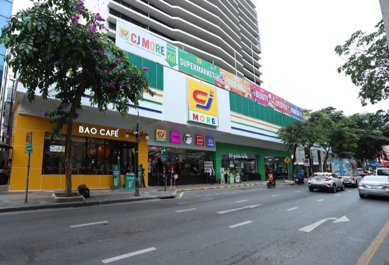
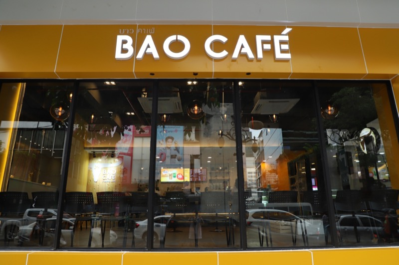

# Abstract
A real online retail transaction data set of two years.

# Dataset Information
This Online Retail II data set contains all the transactions occurring for a UK-based and registered, non-store online retail between 01/12/2009 and 09/12/2011.The company mainly sells unique all-occasion gift-ware. Many customers of the company are wholesalers.

# Images

Reference from https://www.brandbuffet.in.th/2020/11/cj-express-group-strategic-move/

## CJ More
Retail store selling consumer products. 

Including
- bao cafe
- nine beauty

### Supermarket
Sale beer and snack.

### Bao Cafe
Fresh coffee shop.

### Nine Beauty
Cosmetics zone Health and beauty products Multi-brand

# Data Dictionary

## Schema Detail
The table describes a dataset of sales transactions. Each row represents an invoice with details like invoice number, product code, description, quantity, date, unit price, customer ID, and their country.

| Attribute   | Description                                                                                                                                                     |
| ----------- | --------------------------------------------------------------------------------------------------------------------------------------------------------------- |
| InvoiceNo   | Invoice number. Nominal. A 6-digit integral number uniquely assigned to each transaction. If this code starts with the letter ‘c’, it indicates a cancellation. |
| StockCode   | Product (item) code. Nominal. A 5-digit integral number uniquely assigned to each distinct product.                                                             |
| Description | Product (item) name. Nominal.                                                                                                                                   |
| Quantity    | The quantities of each product (item) per transaction. Numeric.                                                                                                 |
| InvoiceDate | Invoice date and time. Numeric. The day and time when a transaction was generated.                                                                              |
| UnitPrice   | Unit price. Numeric. Product price per unit in sterling (£).                                                                                                    |
| CustomerID  | Customer number. Nominal. A 5-digit integral number uniquely assigned to each customer.                                                                         |
| Country     | Country name. Nominal. The name of the country where a customer resides.                                                                                        |

## Data Types
- **Invoice:** Int 
- **StockCode:** String
- **Description:** String
- **Quantity:** Int 
- **InvoiceDate:** String 
- **Price:** Float 
- **Customer ID:** Int
- **Country:** String
## Sample data
This data describes a collection of sales invoices. Each invoice record details a single transaction.

| Invoice | StockCode | Description                         | Quantity | InvoiceDate     | Price | Customer ID | Country        |
|---------|-----------|-------------------------------------|----------|-----------------|-------|-------------|----------------|
| 536365  | 85123A    | WHITE HANGING HEART T-LIGHT HOLDER  | 6        | 1/12/2010 08:26 | 2.55  | 17850       | United Kingdom |
| 536365  | 71053     | WHITE METAL LANTERN                 | 6        | 1/12/2010 08:26 | 3.39  | 17850       | United Kingdom |
| 536365  | 84406B    | CREAM CUPID HEARTS COAT HANGER      | 8        | 1/12/2010 08:26 | 2.75  | 17850       | United Kingdom |
| 536365  | 84029G    | KNITTED UNION FLAG HOT WATER BOTTLE | 6        | 1/12/2010 08:26 | 3.39  | 17850       | United Kingdom |
| 536365  | 84029E    | RED WOOLLY HOTTIE WHITE HEART.      | 6        | 1/12/2010 08:26 | 3.39  | 17850       | United Kingdom 

# Source
Dr. Daqing Chen, Course Director: MSc Data Science. chend '@' lsbu.ac.uk, School of Engineering, London South Bank University, London SE1 0AA, UK.

Please find more information refer the below link,
https://archive.ics.uci.edu/ml/datasets/Online+Retail+II

Kaggle Link,
https://www.kaggle.com/datasets/lakshmi25npathi/online-retail-dataset?resource=download&select=online_retail_II.xlsx
